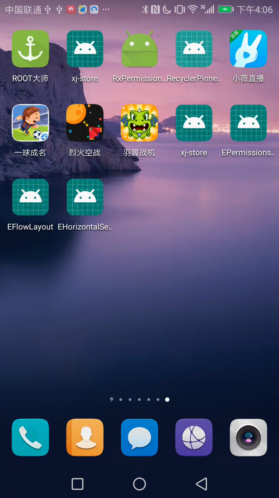

# EHorizontalSelectedView

横向滚动，简易版千度尺。

## 基本使用

    implementation 'com.ccx1:EHorizontalSelectedView:1.0.0'

如果报错请加入

    allprojects {
        repositories {g
            google()
            jcenter()
            maven {url 'https://dl.bintray.com/ci250454344/EHorizontalSelectedView'}
        }
    }

使用方式

    EHorizontalSelectedView horizontalSelectedView = (EHorizontalSelectedView) findViewById(R.id.hsv);
    List<String>            objects                = new ArrayList<>();
    objects.add("1001");
    objects.add("1002");
    objects.add("1003");
    objects.add("1004");
    objects.add("1005");
    objects.add("1006");
    objects.add("1007");
    objects.add("1008");
    objects.add("1009");
    objects.add("10010");
    horizontalSelectedView.setData(objects);
    horizontalSelectedView.setSelectNum(4);
    horizontalSelectedView.setSeeSize(5);

提供了OnRollingListener接口，用于滚动时的监听

    void setOnRollingListener(OnRollingListener onRollingListener)

设置选中第几个,index从0开始

    void setSelectNum(int selectNum)

提供了选中的字颜色

    void setSelectTextColor(int color)

提供了选中字的大小

    void setSelectTextSize(float selectTextSize)

提供了获取选中字的角标

    int getSelectNum()

提供了选中的文字

    String getSelectText()

提供了设置未选中的颜色

    void setOtherTextColor(int color)

提供了设置未选中字的大小，可以产生突出效果

    void setOtherTextSize(float otherTextSize)

提供了设置能够在屏幕上显示几个，内部做了动态处理，如果字过长，则会动态变更

    void setSeeSize(int seeSize)

提供了设置数据的方法

    void setData(List<String> data)

### 提供自定义属性

<table>
<tr>
<td>
otherTextSize
</td>
<td>
设置未选中字的大小,sp单位，或者px，dp都可以
</td>
</tr>
<tr>
<td>
selectTextSize
</td>
<td>
设置选中字的大小,sp单位，或者px，dp都可以
</td>
</tr>
<tr>
<td>
seeSize
</td>
<td>
显示多少个
</td>
</tr>
<tr>
<td>
selectColor
</td>
<td>
设置未选中字的颜色
</td>
</tr>
<tr>
<td>
otherColor
</td>
<td>
设置选中字的颜色
</td>
</tr>
</table>